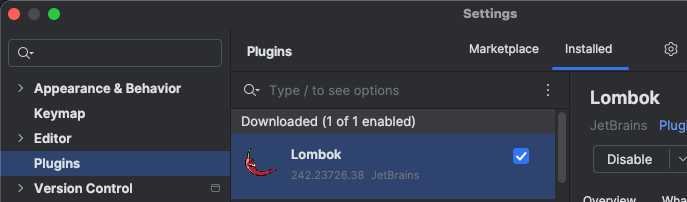
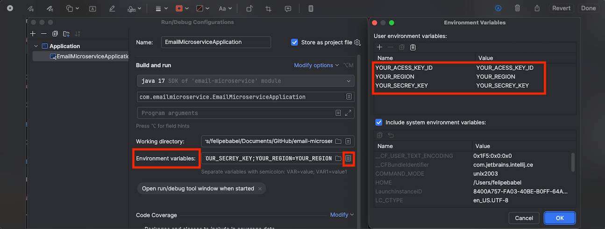
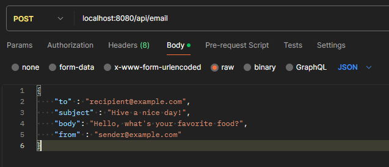

<p align="center">
  
</p>

<p align="center">
  
  
  
  
  
  
</p>

# ✉️ Email Microservice

This microservice sends emails using [AWS SES](https://aws.amazon.com/ses/), with two main features:

- ✅ Simple email sending via API
- 📎 Generates and sends **random PDF attachments**

Ready to run via **Docker** or **Maven**, with code quality ensured by **Checkstyle** and **JaCoCo test coverage ≥ 80%**.


## 🎥 Demo
<p align="center">  </p>
This demo shows:

* Maven installation

* Docker startup

* Sending an email via Swagger UI


## 🐳 Docker

The fastest way to get the project up and running:

```bash
docker-compose up --build
```

🔐 Don't forget to update your AWS credentials in
[docker-compose.yml](docker-compose.yml)


## ⚙️ Manual Setup

Clone the repository:

```bash
git clone https://github.com/felipebabel/email-microservice.git
```

Install dependencies with Maven

```bash
mvn clean install
```

## 🔧 Configuration

Install the Lombok plugin in your IDE:



Set your AWS credentials as environment variables:



Ensure Java 21 is installed and set as default:

```bash
java -version
```


## ▶️ Running with Maven
You can run the application with:

```task
mvn spring-boot:run
```

Or run the main class directly from your IDE:
[EmailMicroserviceApplication.java](src/main/java/com/emailmicroservice/EmailMicroserviceApplication.java)

The API will be available at:

📎 http://localhost:8080

## 📬 Available Endpoints

* POST /send-email: Sends a plain email
* POST /send-random-pdf: Generates and sends an email with a random PDF attachment

Postman example:




## 📑 API Documentation

Interactive API docs are available via Swagger:

📎 http://localhost:8080/swagger-ui/index.html#/

✅ Same URL when running via Docker

## 📁 Reports

[Checkstyle Result](target/checkstyle-reports/checkstyle-report.xml)

[JaCoCo test coverage](target/site/jacoco/jacoco.xml)


## 🧰 Tech Stack

* Java 21

* Spring Boot

* AWS SES

* Docker

* Maven

* JaCoCo (≥ 80% coverage)

* Checkstyle (fully passing)

## 🤝 Contributing
Pull requests are welcome! Feel free to open issues for bugs, suggestions, or improvements.