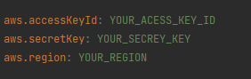
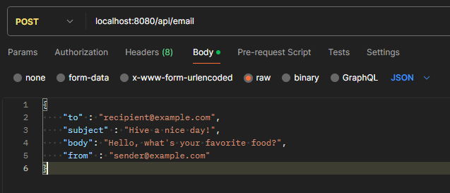

# Email Microservice

This microservice send an email using the [AWS SES](https://aws.amazon.com/pt/ses/).
Technologies used: Java, Java Spring, AWS.

- [Installation](#installation)
- [Configuration](#configuration)
- [Execute](#execute)
- [Documentation](#documentation)

## Installation

1. Clone the repository:

```bash
git clone https://github.com/felipebabel/email-microservice.git
```

2. Install dependencies with Maven
## Configuration
In the [application.properties](src/main/resources/application.properties) file,
it's necessary to change the fields aws.accessKeyId, aws.secretKey and aws.region for your AWS credentials.



## Execute

1. To run the microservice, run task or run for
the [EmailMicroserviceApplication.java](src/main/java/com/emailmicroservice/EmailMicroserviceApplication.java) file.


```task
mvn spring-boot:run
```
2. The API will be accessible at http://localhost:8080

3. Postman request example:



## Documentation

[Swagger UI](http://localhost:8080/swagger-ui/index.html#/)


# TO DO LIST

#### swagger api e no dto
#### json return arrumar
#### TESTES